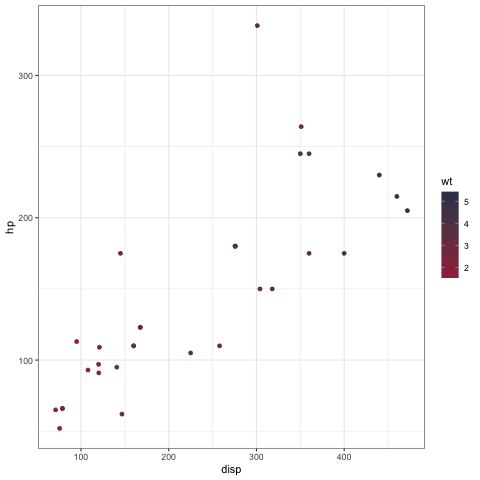

# BT.Theme

## Overview
`BT.Theme` is a simple package to enable quick implementation of a consistent color theme across all figures/graphics.

## How to Install BT.Theme
`BT.Theme` can be installed from this Github repository by simply copying the following lines of code into your R terminal, which will install everything that you need to use `BT.Theme` on your computer: 
  ```{r}
if (!require("devtools")) 
  install.packages("devtools")

devtools::install_github("lorisipsum/BT.Theme")
library(BT.Theme)
```

## Usage
### Basic ggplot2 graphs
#### First install packages and load data
```{r}
library(tidyverse)
library(BT.theme)
```

#### Discrete Scale Color
```{r}
mtcars |> ggplot(aes(disp, hp, color = factor(cyl))) + geom_point() + scale_color_brian_d() + theme_bw() + guides(color=guide_legend(title="# of Cylinders"))
```


#### Continuous Scale Color
```{r}
mtcars |> ggplot(aes(disp, hp, color = wt)) + geom_point() + scale_color_brian_c(color_palette = "Red") + theme_bw()
```


#### Discrete Scale Fill
```{r}
mtcars |> ggplot(aes(factor(cyl), hp, fill = factor(cyl))) + geom_bar(stat = "identity") + 
  scale_fill_brian_d() + theme_bw() + xlab("# of Cylinders") + guides(fill = guide_legend(title="# of Cylinders"))
```


#### Continuous Scale Fill
```{r}
mtcars |> ggplot(aes(x = wt, y = disp)) +
  stat_density_2d(aes(fill = ..level..), geom = "polygon", color = "white") +
  scale_fill_brian_c() + 
  labs(
    x = "Weight (wt)",
    y = "Displacement (disp)",
    fill = "Density") +
  theme_bw()
```


#### Diverging Scale Fill
```{r}
cm <- cor(mtcars)
df <- data.frame(cor = c(cm), var1 = factor(col(cm)), var2 = factor(row(cm)))
levels(df$var1) <- levels(df$var2) <- names(mtcars)
ggplot(df, aes(var1, var2, fill = cor)) + 
  geom_tile() + 
  coord_fixed() +
  ylab("variable") +
  scale_x_discrete(position = "top", name = "variable") +
  scale_fill_brian_diverging()

Code adapted from: https://colorspace.r-forge.r-project.org/articles/ggplot2_color_scales.html
```


#### Diverging Scale Color
```{r}
mtcars |> ggplot(aes(disp, hp, color = scale(wt))) + geom_point() + scale_color_brian_diverging(reverse = TRUE) + 
  theme_bw() + guides(color=guide_legend(title="Scaled Car Weight"))
```


### General Reminders
Functions may contain two color palettes which can be changed via the `color_palette` argument. 
The order of the colors within all functions can also be reversed via `reverse = TRUE`.

## Description
Package: BT.Theme
Title: For use in my ggplot graphs
Version: 0.0.0.1000
Authors@R: 
        person(given = "Brian", family = "Thompson", email = "dr.brianthompson1@gmail.com", role = c("aut", "cre"))
Description: I am to use BT_Colors to ensure that all of my graphs and figures are made with a consistent color scheme. In other words, I do not want to have to remember hex codes :). Created by me (Brian) in the fall of 2024.
License: MIT + file LICENSE
Encoding: UTF-8
Roxygen: list(markdown = TRUE)
RoxygenNote: 7.3.2
Imports: 
    ggplot2
